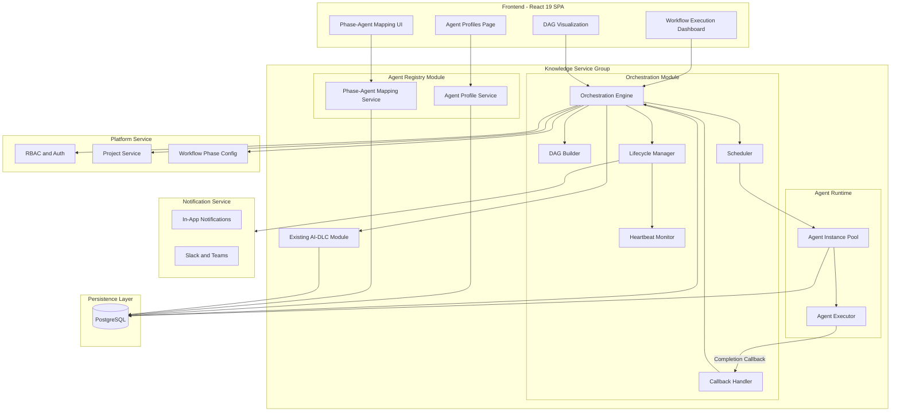
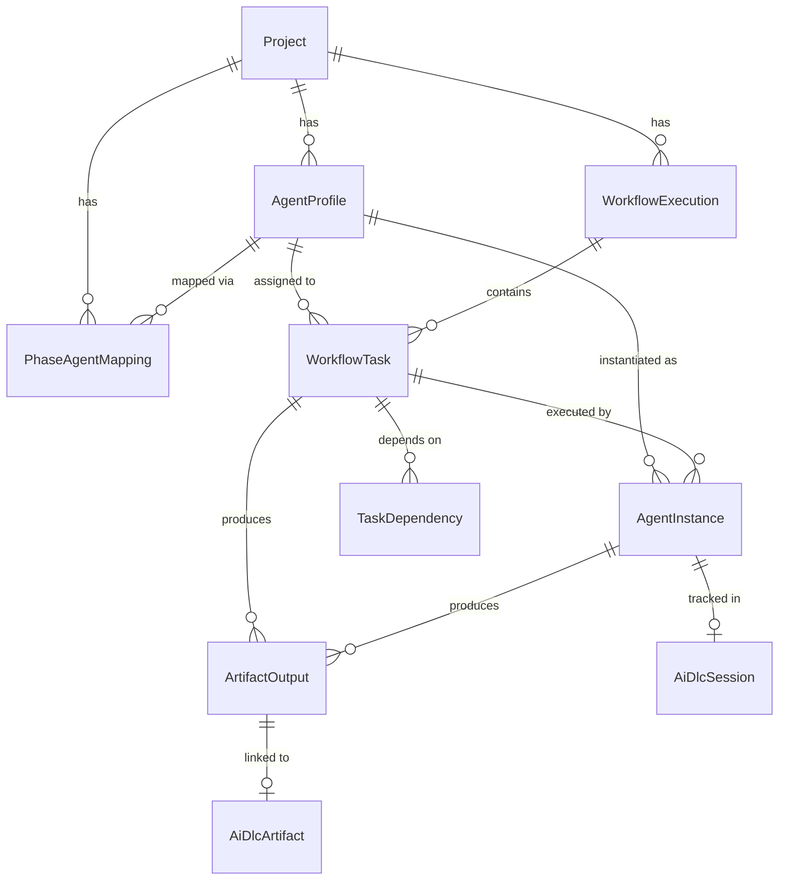
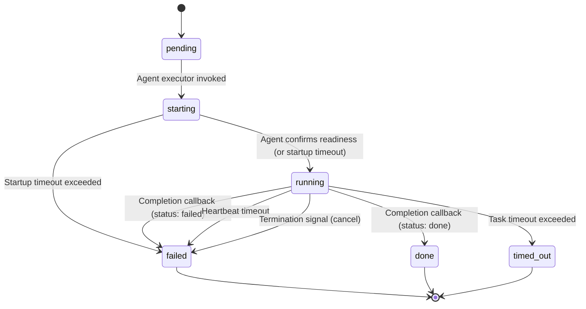

# Design Document — Agent-based Workflow Automation

## Overview

Agent-based Workflow Automation introduces an intelligent orchestration layer to SDLC Hub (v4) that automatically decomposes, schedules, and executes SDLC workflow tasks by assigning them to specialized AI agent profiles. The system maps each configurable SDLC phase to one or more agent profiles, builds a dependency graph (DAG) of tasks, and executes independent tasks in parallel while respecting ordering constraints.

### Key Design Goals

- **Automated task decomposition**: Given a project's SDLC phases and phase-to-agent mappings, the engine generates a DAG of tasks and assigns each to the appropriate agent.
- **Parallel execution**: Tasks without dependencies run concurrently, bounded by a configurable concurrency limit.
- **Agent lifecycle management**: Each agent instance follows a well-defined state machine (pending → starting → running → done/failed/timed_out) with heartbeat monitoring and retry logic.
- **Integration with existing AI-DLC**: Agent sessions and artifacts are tracked through the existing `ai_dlc_sessions` and `ai_dlc_artifacts` tables.
- **Real-time monitoring**: A dashboard visualizes the DAG, task states, critical path, and overall progress.

### Module Placement

The Orchestration Engine is placed as a new module within the **Knowledge Service** group, alongside the existing AI-DLC module. This co-location is justified because:
1. It orchestrates AI-driven workflows (same domain as AI-DLC).
2. It directly integrates with `ai_dlc_sessions`, `ai_dlc_artifacts`, `ai_approvals`, and `ai_clarifications`.
3. It does not introduce a fundamentally different scaling profile in v4 initial release (in-process execution).

If agent workloads grow significantly, the module can be extracted into a fifth service group ("Automation Service") without breaking the modular monolith boundaries.

---

## Architecture

### System Component Diagram



### Data Flow

```
Workflow Start (User Action)
       |
       v
+-----------------------------------+
| 1. Validate Phase-Agent Mappings  |
|    and Project Config             |
+-----------------------------------+
       |
       v
+-----------------------------------+
| 2. Task Decomposition             |
|    - Read SDLC phases             |
|    - Create tasks per phase       |
|    - Assign agent profiles        |
+-----------------------------------+
       |
       v
+-----------------------------------+
| 3. DAG Construction               |
|    - Build dependency edges       |
|    - Persist graph to DB          |
+-----------------------------------+
       |
       v
+-----------------------------------+
| 4. DAG Evaluation                 |
|    - Find tasks with no           |
|      unresolved dependencies      |
|    - Respect concurrency limit    |
+-----------------------------------+
       |
       v
+-----------------------------------+
| 5. Agent Start                    |
|    - Create agent instance        |
|    - Create ai_dlc_session        |
|    - Transition: pending ->       |
|      starting -> running          |
+-----------------------------------+
       |
       v
+-----------------------------------+
| 6. Execution and Monitoring       |
|    - Agent performs work           |
|    - Heartbeat checks             |
|    - Timeout detection            |
+-----------------------------------+
       |
       v
+-----------------------------------+
| 7. Completion Callback            |
|    - Agent reports done/failed    |
|    - Store artifacts              |
|    - Create ai_dlc_artifact       |
+-----------------------------------+
       |
       v
+-----------------------------------+
| 8. Re-evaluation                  |
|    - Update task status           |
|    - Re-evaluate DAG              |
|    - Start newly eligible         |
|      tasks (back to step 4)       |
+-----------------------------------+
       |
       v
+-----------------------------------+
| 9. Workflow Complete              |
|    - All tasks terminal           |
|    - Send summary notification    |
+-----------------------------------+
```

### Integration Points

| Integration | Service | Purpose |
|---|---|---|
| Platform Service (RBAC) | Auth guard on all endpoints | Only Project Owners can manage profiles, mappings, and executions |
| Platform Service (Projects) | Project context | Workflow phases, project membership |
| Knowledge Service (AI-DLC) | Session and artifact tracking | Create `ai_dlc_sessions` on agent start, `ai_dlc_artifacts` on output |
| Knowledge Service (AI-DLC) | Approval and clarification | Use `ai_approvals` for human-in-the-loop, `ai_clarifications` for agent questions |
| Notification Service | Alerts | Failure notifications, completion summaries via in-app, Slack, Teams |

---

## Components and Interfaces

### 1. Agent Profile Service

Manages CRUD operations for agent profiles.

```typescript
interface AgentProfileService {
  create(projectId: string, dto: CreateAgentProfileDto): Promise<AgentProfile>;
  findAll(projectId: string): Promise<AgentProfile[]>;
  findById(id: string): Promise<AgentProfile>;
  update(id: string, dto: UpdateAgentProfileDto): Promise<AgentProfile>;
  delete(id: string): Promise<void>;
  seedDefaults(projectId: string): Promise<void>;
}

interface CreateAgentProfileDto {
  name: string;
  role: AgentRole; // BA | Dev | QA | DevOps | Designer | SRE
  description: string;
  skillSet: string[];
  supportedPhases: string[]; // phase IDs
}
```

### 2. Phase-Agent Mapping Service

Manages the association between SDLC phases and agent profiles.

```typescript
interface PhaseAgentMappingService {
  create(projectId: string, dto: CreateMappingDto): Promise<PhaseAgentMapping>;
  findByProject(projectId: string): Promise<PhaseAgentMapping[]>;
  findByPhase(projectId: string, phaseId: string): Promise<PhaseAgentMapping[]>;
  update(id: string, dto: UpdateMappingDto): Promise<PhaseAgentMapping>;
  delete(id: string): Promise<void>;
  validateMappings(projectId: string): Promise<ValidationResult>;
}

interface CreateMappingDto {
  phaseId: string;
  agentProfileId: string;
  priority: number; // lower number = higher priority
}
```

### 3. Orchestration Engine

The core service that coordinates workflow execution.

```typescript
interface OrchestrationEngine {
  startExecution(projectId: string, config: WorkflowConfig): Promise<WorkflowExecution>;
  pauseExecution(executionId: string): Promise<WorkflowExecution>;
  resumeExecution(executionId: string): Promise<WorkflowExecution>;
  cancelExecution(executionId: string): Promise<WorkflowExecution>;
  getExecution(executionId: string): Promise<WorkflowExecutionDetail>;
  handleCallback(callback: CompletionCallback): Promise<void>;
}

interface WorkflowConfig {
  maxConcurrency: number;        // default: 5
  heartbeatIntervalMs: number;   // default: 30000
  startupTimeoutMs: number;      // default: 60000
  taskTimeoutMs: number;         // default: 600000
  maxRetries: number;            // default: 2
}
```

### 4. DAG Builder

Constructs the dependency graph from project phases and mappings.

```typescript
interface DAGBuilder {
  buildDAG(
    phases: WorkflowPhase[],
    mappings: PhaseAgentMapping[],
    config?: DAGConfig
  ): TaskDAG;
}

interface TaskDAG {
  tasks: TaskNode[];
  edges: DependencyEdge[];
  getEligibleTasks(): TaskNode[];
  markCompleted(taskId: string): void;
  getCriticalPath(): TaskNode[];
  getProgress(): { completed: number; total: number; percentage: number };
}

interface TaskNode {
  id: string;
  phaseId: string;
  phaseName: string;
  agentProfileId: string;
  status: TaskStatus;
  dependencies: string[];  // task IDs this depends on
}

interface DependencyEdge {
  fromTaskId: string;
  toTaskId: string;
}
```

### 5. Scheduler

Evaluates the DAG and starts eligible tasks within concurrency limits.

```typescript
interface Scheduler {
  evaluate(execution: WorkflowExecution): Promise<TaskNode[]>;
  getAvailableSlots(execution: WorkflowExecution): number;
}
```

### 6. Lifecycle Manager

Manages agent instance state transitions and health monitoring.

```typescript
interface LifecycleManager {
  startAgent(task: WorkflowTask, profile: AgentProfile): Promise<AgentInstance>;
  recordHeartbeat(instanceId: string): Promise<void>;
  checkHealth(): Promise<HealthCheckResult[]>;
  terminateAgent(instanceId: string, reason: string): Promise<void>;
  retryTask(task: WorkflowTask): Promise<AgentInstance | null>;
}

enum AgentInstanceStatus {
  pending = 'pending',
  starting = 'starting',
  running = 'running',
  done = 'done',
  failed = 'failed',
  timed_out = 'timed_out',
}
```

### 7. Callback Handler

Processes completion callbacks from agents.

```typescript
interface CallbackHandler {
  processCallback(callback: CompletionCallback): Promise<void>;
}

interface CompletionCallback {
  taskId: string;
  instanceId: string;
  status: 'done' | 'failed';
  artifacts?: ArtifactOutput[];
  error?: string;
  durationMs: number;
  resourceMetrics?: ResourceMetrics;
}

interface ArtifactOutput {
  type: ArtifactType;
  name: string;
  contentRef: string;
  metadata?: Record<string, unknown>;
}

type ArtifactType = 'document' | 'code' | 'test_plan' | 'deployment_script' | 'review_report' | 'custom';
```

### 8. Agent Executor (Runtime)

Responsible for actually running agent instances. In v4 initial release, this is in-process.

```typescript
interface AgentExecutor {
  start(instance: AgentInstance, context: AgentContext): Promise<void>;
  sendTermination(instanceId: string): Promise<boolean>;
  forceTerminate(instanceId: string): Promise<void>;
}

interface AgentContext {
  task: WorkflowTask;
  profile: AgentProfile;
  inputArtifacts: ArtifactOutput[];
  sessionId: string;
  callbackUrl: string;
}
```

---

## Data Models

### Database Schema (Prisma-style)

```prisma
// --- Agent Profile Registry ---

enum AgentRole {
  BA
  Dev
  QA
  DevOps
  Designer
  SRE
}

model AgentProfile {
  id              String   @id @default(uuid())
  projectId       String?  @map("project_id")
  name            String
  role            AgentRole
  description     String
  skillSet        String[] @map("skill_set")
  supportedPhases String[] @map("supported_phases")
  isDefault       Boolean  @default(false) @map("is_default")
  createdAt       DateTime @default(now()) @map("created_at")
  updatedAt       DateTime @updatedAt @map("updated_at")

  project              Project?             @relation(fields: [projectId], references: [id])
  phaseAgentMappings   PhaseAgentMapping[]
  workflowTasks        WorkflowTask[]
  agentInstances       AgentInstance[]

  @@map("agent_profiles")
  @@index([projectId])
  @@index([role])
  @@index([isDefault])
}

// --- Phase-Agent Mapping ---

model PhaseAgentMapping {
  id             String   @id @default(uuid())
  projectId      String   @map("project_id")
  phaseId        String   @map("phase_id")
  agentProfileId String   @map("agent_profile_id")
  priority       Int      @default(0)
  createdAt      DateTime @default(now()) @map("created_at")

  project      Project      @relation(fields: [projectId], references: [id])
  agentProfile AgentProfile @relation(fields: [agentProfileId], references: [id])

  @@map("phase_agent_mappings")
  @@unique([projectId, phaseId, agentProfileId])
  @@index([projectId, phaseId])
}

// --- Workflow Execution ---

enum WorkflowExecutionStatus {
  pending
  running
  paused
  completed
  cancelled
  blocked
}

model WorkflowExecution {
  id          String                  @id @default(uuid())
  projectId   String                  @map("project_id")
  status      WorkflowExecutionStatus @default(pending)
  config      Json
  startedAt   DateTime?               @map("started_at")
  completedAt DateTime?               @map("completed_at")
  initiatedBy String                  @map("initiated_by")
  createdAt   DateTime                @default(now()) @map("created_at")
  updatedAt   DateTime                @updatedAt @map("updated_at")

  project Project         @relation(fields: [projectId], references: [id])
  user    User            @relation(fields: [initiatedBy], references: [id])
  tasks   WorkflowTask[]

  @@map("workflow_executions")
  @@index([projectId, status])
  @@index([initiatedBy])
}

// --- Workflow Task ---

enum TaskStatus {
  pending
  assigned
  running
  done
  failed
  cancelled
  timed_out
}

model WorkflowTask {
  id                   String     @id @default(uuid())
  workflowExecutionId  String     @map("workflow_execution_id")
  phaseId              String     @map("phase_id")
  agentProfileId       String     @map("agent_profile_id")
  status               TaskStatus @default(pending)
  startedAt            DateTime?  @map("started_at")
  completedAt          DateTime?  @map("completed_at")
  error                String?
  retryCount           Int        @default(0) @map("retry_count")
  createdAt            DateTime   @default(now()) @map("created_at")
  updatedAt            DateTime   @updatedAt @map("updated_at")

  workflowExecution    WorkflowExecution    @relation(fields: [workflowExecutionId], references: [id], onDelete: Cascade)
  agentProfile         AgentProfile         @relation(fields: [agentProfileId], references: [id])
  agentInstances       AgentInstance[]
  artifactOutputs      ArtifactOutput[]
  dependsOn            TaskDependency[]     @relation("dependent_task")
  dependedOnBy         TaskDependency[]     @relation("prerequisite_task")

  @@map("workflow_tasks")
  @@index([workflowExecutionId, status])
  @@index([agentProfileId])
}

// --- Task Dependencies ---

model TaskDependency {
  id              String @id @default(uuid())
  taskId          String @map("task_id")
  dependsOnTaskId String @map("depends_on_task_id")

  task          WorkflowTask @relation("dependent_task", fields: [taskId], references: [id], onDelete: Cascade)
  dependsOnTask WorkflowTask @relation("prerequisite_task", fields: [dependsOnTaskId], references: [id], onDelete: Cascade)

  @@map("task_dependencies")
  @@unique([taskId, dependsOnTaskId])
  @@index([taskId])
  @@index([dependsOnTaskId])
}

// --- Agent Instance ---

enum AgentInstanceStatus {
  pending
  starting
  running
  done
  failed
  timed_out
}

model AgentInstance {
  id              String              @id @default(uuid())
  workflowTaskId  String              @map("workflow_task_id")
  agentProfileId  String              @map("agent_profile_id")
  sessionId       String?             @map("session_id")
  status          AgentInstanceStatus @default(pending)
  startedAt       DateTime?           @map("started_at")
  lastHeartbeat   DateTime?           @map("last_heartbeat")
  completedAt     DateTime?           @map("completed_at")
  durationMs      Int?                @map("duration_ms")
  error           String?
  createdAt       DateTime            @default(now()) @map("created_at")
  updatedAt       DateTime            @updatedAt @map("updated_at")

  workflowTask    WorkflowTask    @relation(fields: [workflowTaskId], references: [id], onDelete: Cascade)
  agentProfile    AgentProfile    @relation(fields: [agentProfileId], references: [id])
  session         AiDlcSession?   @relation(fields: [sessionId], references: [id])
  artifactOutputs ArtifactOutput[]

  @@map("agent_instances")
  @@index([workflowTaskId])
  @@index([status])
  @@index([lastHeartbeat])
}

// --- Artifact Output ---

enum ArtifactType {
  document
  code
  test_plan
  deployment_script
  review_report
  custom
}

model ArtifactOutput {
  id                String       @id @default(uuid())
  workflowTaskId    String       @map("workflow_task_id")
  agentInstanceId   String       @map("agent_instance_id")
  artifactType      ArtifactType @map("artifact_type")
  name              String
  contentRef        String       @map("content_ref")
  aiDlcArtifactId   String?      @map("ai_dlc_artifact_id")
  metadata          Json?
  createdAt         DateTime     @default(now()) @map("created_at")

  workflowTask    WorkflowTask   @relation(fields: [workflowTaskId], references: [id], onDelete: Cascade)
  agentInstance   AgentInstance   @relation(fields: [agentInstanceId], references: [id])
  aiDlcArtifact   AiDlcArtifact? @relation(fields: [aiDlcArtifactId], references: [id])

  @@map("artifact_outputs")
  @@index([workflowTaskId])
  @@index([agentInstanceId])
  @@index([aiDlcArtifactId])
}
```

### Entity Relationship Diagram



### Relationships to Existing Tables

| New Table | Existing Table | Relationship |
|---|---|---|
| `agent_profiles` | `projects` | Many-to-one (profile belongs to project, or null for defaults) |
| `workflow_executions` | `projects` | Many-to-one (execution belongs to project) |
| `workflow_executions` | `users` | Many-to-one (initiated by user) |
| `agent_instances` | `ai_dlc_sessions` | One-to-one (each instance creates a session) |
| `artifact_outputs` | `ai_dlc_artifacts` | One-to-one (each output links to an artifact record) |

---


## API Design

### Agent Profiles API

| Method | Endpoint | Description |
|---|---|---|
| POST | `/api/projects/:projectId/agent-profiles` | Create agent profile |
| GET | `/api/projects/:projectId/agent-profiles` | List all profiles (includes defaults) |
| GET | `/api/projects/:projectId/agent-profiles/:id` | Get profile by ID |
| PUT | `/api/projects/:projectId/agent-profiles/:id` | Update profile |
| DELETE | `/api/projects/:projectId/agent-profiles/:id` | Delete profile |

**Create Agent Profile Request:**
```json
{
  "name": "Senior Dev Agent",
  "role": "Dev",
  "description": "Handles implementation tasks including code generation and refactoring",
  "skillSet": ["typescript", "nestjs", "prisma", "react"],
  "supportedPhases": ["phase-uuid-in-dev", "phase-uuid-in-review"]
}
```

**Agent Profile Response:**
```json
{
  "id": "uuid",
  "projectId": "uuid",
  "name": "Senior Dev Agent",
  "role": "Dev",
  "description": "Handles implementation tasks...",
  "skillSet": ["typescript", "nestjs", "prisma", "react"],
  "supportedPhases": ["phase-uuid-in-dev", "phase-uuid-in-review"],
  "isDefault": false,
  "createdAt": "2026-06-01T10:00:00Z",
  "updatedAt": "2026-06-01T10:00:00Z"
}
```

**Validation Rules:**
- `name`: required, 1-100 characters
- `role`: required, one of BA/Dev/QA/DevOps/Designer/SRE
- `skillSet`: required, at least 1 item
- `supportedPhases`: required, at least 1 valid phase ID for the project
- Update rejected if profile is referenced by a running workflow execution
- Delete rejected if profile is referenced by any phase-agent mapping

### Phase-Agent Mappings API

| Method | Endpoint | Description |
|---|---|---|
| POST | `/api/projects/:projectId/phase-agent-mappings` | Create mapping |
| GET | `/api/projects/:projectId/phase-agent-mappings` | List all mappings |
| GET | `/api/projects/:projectId/phase-agent-mappings?phaseId=:phaseId` | Filter by phase |
| PUT | `/api/projects/:projectId/phase-agent-mappings/:id` | Update mapping |
| DELETE | `/api/projects/:projectId/phase-agent-mappings/:id` | Delete mapping |
| POST | `/api/projects/:projectId/phase-agent-mappings/validate` | Validate all mappings |

**Create Mapping Request:**
```json
{
  "phaseId": "phase-uuid-in-dev",
  "agentProfileId": "agent-profile-uuid",
  "priority": 1
}
```

**Validation Response (POST /validate):**
```json
{
  "valid": false,
  "issues": [
    {
      "phaseId": "phase-uuid-in-test",
      "phaseName": "In Test",
      "issue": "no_mapping",
      "message": "Phase 'In Test' has no agent mapping configured"
    },
    {
      "phaseId": "phase-uuid-in-dev",
      "agentProfileId": "agent-uuid",
      "issue": "phase_not_supported",
      "message": "Agent 'BA_Agent' does not support phase 'In Dev'"
    }
  ]
}
```

### Workflow Executions API

| Method | Endpoint | Description |
|---|---|---|
| POST | `/api/projects/:projectId/workflow-executions` | Start execution |
| GET | `/api/projects/:projectId/workflow-executions` | List executions |
| GET | `/api/projects/:projectId/workflow-executions/:execId` | Get execution detail |
| PATCH | `/api/projects/:projectId/workflow-executions/:execId` | Pause/Resume/Cancel |
| GET | `/api/projects/:projectId/workflow-executions/:execId/tasks` | List tasks |
| GET | `/api/projects/:projectId/workflow-executions/:execId/dag` | Get DAG structure |
| GET | `/api/projects/:projectId/workflow-executions/:execId/artifacts` | List all artifacts |

**Start Execution Request:**
```json
{
  "config": {
    "maxConcurrency": 5,
    "heartbeatIntervalMs": 30000,
    "startupTimeoutMs": 60000,
    "taskTimeoutMs": 600000,
    "maxRetries": 2
  }
}
```

**Execution Detail Response:**
```json
{
  "id": "exec-uuid",
  "projectId": "project-uuid",
  "status": "running",
  "config": { "maxConcurrency": 5, "..." : "..." },
  "startedAt": "2026-06-01T10:00:00Z",
  "completedAt": null,
  "initiatedBy": { "id": "user-uuid", "name": "John Doe" },
  "progress": { "completed": 3, "total": 7, "percentage": 42.8 },
  "tasks": [
    {
      "id": "task-uuid",
      "phaseId": "phase-uuid",
      "phaseName": "In Dev",
      "agentProfileId": "agent-uuid",
      "agentName": "Dev_Agent",
      "status": "running",
      "startedAt": "2026-06-01T10:01:00Z",
      "elapsedMs": 120000,
      "retryCount": 0
    }
  ],
  "createdAt": "2026-06-01T10:00:00Z"
}
```

**Pause/Resume/Cancel Request:**
```json
{
  "action": "pause"
}
```
Valid actions: `pause`, `resume`, `cancel`

**DAG Response:**
```json
{
  "tasks": [
    { "id": "task-1", "phaseId": "p1", "phaseName": "Requirements", "status": "done", "agentName": "BA_Agent" },
    { "id": "task-2", "phaseId": "p2", "phaseName": "In Dev", "status": "running", "agentName": "Dev_Agent" },
    { "id": "task-3", "phaseId": "p3", "phaseName": "In Test", "status": "pending", "agentName": "QA_Agent" }
  ],
  "edges": [
    { "from": "task-1", "to": "task-2" },
    { "from": "task-1", "to": "task-3" },
    { "from": "task-2", "to": "task-3" }
  ],
  "criticalPath": ["task-1", "task-2", "task-3"]
}
```

### Agent Callback API

| Method | Endpoint | Description |
|---|---|---|
| POST | `/api/agent-callback` | Agent completion callback |
| POST | `/api/agent-heartbeat` | Agent heartbeat |

**Completion Callback Request:**
```json
{
  "taskId": "task-uuid",
  "instanceId": "instance-uuid",
  "status": "done",
  "artifacts": [
    {
      "type": "document",
      "name": "requirements-spec.md",
      "contentRef": "artifacts/exec-uuid/task-uuid/requirements-spec.md",
      "metadata": { "wordCount": 2500, "sections": 8 }
    }
  ],
  "durationMs": 45000,
  "resourceMetrics": {
    "tokensUsed": 15000,
    "apiCalls": 3
  }
}
```

**Heartbeat Request:**
```json
{
  "instanceId": "instance-uuid",
  "timestamp": "2026-06-01T10:05:00Z"
}
```

**Heartbeat Response:**
```json
{
  "acknowledged": true,
  "shouldTerminate": false
}
```

The `shouldTerminate` field allows the engine to signal graceful shutdown to agents (e.g., when a workflow is being cancelled).

---

## Orchestration Engine Design

### DAG Builder Algorithm

The DAG is constructed from the project's ordered SDLC phases and phase-to-agent mappings:

1. **Phase ordering**: Read the project's SDLC phases in configured order (e.g., Requirements -> Dev -> Review -> Test -> Release).
2. **Task creation**: For each phase that has a phase-agent mapping, create one task per mapped agent profile.
3. **Dependency inference**: By default, tasks in phase N depend on all tasks in phase N-1 (sequential phase ordering). This creates a layered DAG where each layer is a phase.
4. **Parallel within phase**: Multiple tasks within the same phase have no dependencies between them and execute in parallel.
5. **Custom dependencies**: Future enhancement — allow explicit dependency overrides (e.g., skip a phase, add cross-phase dependencies).

```typescript
function buildDAG(phases: WorkflowPhase[], mappings: PhaseAgentMapping[]): TaskDAG {
  const tasks: TaskNode[] = [];
  const edges: DependencyEdge[] = [];
  let previousPhaseTasks: TaskNode[] = [];

  // Phases are sorted by their configured order
  for (const phase of phases.sort((a, b) => a.order - b.order)) {
    const phaseMappings = mappings.filter(m => m.phaseId === phase.id);

    if (phaseMappings.length === 0) {
      // No mapping for this phase - skip (log warning)
      continue;
    }

    const currentPhaseTasks: TaskNode[] = [];

    for (const mapping of phaseMappings) {
      const task: TaskNode = {
        id: generateId(),
        phaseId: phase.id,
        phaseName: phase.name,
        agentProfileId: mapping.agentProfileId,
        status: 'pending',
        dependencies: previousPhaseTasks.map(t => t.id),
      };
      tasks.push(task);
      currentPhaseTasks.push(task);

      // Create edges from all previous phase tasks to this task
      for (const prevTask of previousPhaseTasks) {
        edges.push({ fromTaskId: prevTask.id, toTaskId: task.id });
      }
    }

    previousPhaseTasks = currentPhaseTasks;
  }

  return { tasks, edges, ... };
}
```

### Scheduler Loop (Event-Driven)

The scheduler is event-driven, not polling-based. It re-evaluates on these triggers:

1. **Workflow started**: Initial evaluation to find root tasks (no dependencies).
2. **Task completed**: Re-evaluate to find newly unblocked tasks.
3. **Task failed**: Re-evaluate; downstream tasks may be blocked permanently.
4. **Workflow resumed**: Re-evaluate after pause.

```typescript
async function evaluateAndSchedule(execution: WorkflowExecution): Promise<void> {
  const dag = await loadDAG(execution.id);
  const eligibleTasks = dag.getEligibleTasks(); // pending tasks with all deps done
  const runningCount = await getRunningTaskCount(execution.id);
  const availableSlots = execution.config.maxConcurrency - runningCount;

  const tasksToStart = eligibleTasks.slice(0, availableSlots);

  for (const task of tasksToStart) {
    await startAgentForTask(task);
  }

  // Check if workflow is complete
  if (await allTasksTerminal(execution.id)) {
    await markExecutionComplete(execution.id);
    await sendCompletionNotification(execution);
  }
}
```

### Concurrency Control

- **Per-execution limit**: Configurable `maxConcurrency` (default: 5, max: 10 per NFR-20).
- **Enforcement**: Before starting a new agent, check `COUNT(agent_instances WHERE status IN ('starting', 'running') AND workflow_task.workflow_execution_id = :execId)`.
- **Backpressure**: If all slots are full, eligible tasks remain in `pending` state until a slot opens (triggered by next completion callback).

### Heartbeat Monitoring

- **Interval**: Configurable per execution (default: 30 seconds).
- **Protocol**: Agent sends POST to `/api/agent-heartbeat` with instance ID.
- **Detection**: A cron job runs every `heartbeatInterval` and queries for instances where `status = 'running' AND last_heartbeat < NOW() - 2 * heartbeatInterval`.
- **Action on miss**: Mark instance as `failed` with reason `heartbeat_timeout`, trigger retry logic.

```typescript
// Runs on cron schedule (every 30s)
async function checkHeartbeats(): Promise<void> {
  const staleInstances = await prisma.agentInstance.findMany({
    where: {
      status: 'running',
      lastHeartbeat: {
        lt: new Date(Date.now() - 2 * HEARTBEAT_INTERVAL_MS),
      },
    },
  });

  for (const instance of staleInstances) {
    await markFailed(instance.id, 'heartbeat_timeout');
    await retryOrFail(instance.workflowTaskId);
  }
}
```

### Retry and Failure Handling

- **Retry limit**: Configurable `maxRetries` per execution (default: 2).
- **Retry strategy**: On failure or timeout, increment `retryCount` on the task. If `retryCount < maxRetries`, create a new agent instance for the same task.
- **Permanent failure**: If retries exhausted, mark task as `failed`. Notify Project Owner.
- **Downstream impact**: Tasks depending on a permanently failed task cannot execute. The workflow continues for independent branches but reports partial completion.
- **Workflow blocked**: If a failed task has no alternative path and blocks all remaining tasks, mark execution as `blocked`.

### Agent Instance State Machine



---

## Agent Communication Protocol

### Agent Startup (v4 Initial: In-Process)

In the initial v4 release, agents run in-process within the NestJS backend:

1. **Orchestration Engine** calls `AgentExecutor.start(instance, context)`.
2. **AgentExecutor** spawns an async task (Promise) that:
   - Transitions instance to `starting`.
   - Initializes the agent with its profile and input artifacts.
   - Transitions to `running` once ready.
   - Begins periodic heartbeat reporting.
   - Executes the agent's work.
   - Sends completion callback on finish.

### Scalability Path (Future: Worker Pool)

When agent workloads grow beyond in-process capacity:
- Extract agent execution to a separate worker service.
- Communication via message broker (NATS/Kafka, already available from v2).
- Orchestration Engine publishes `task.start` messages; workers consume and execute.
- Callbacks and heartbeats continue via REST (or switch to message-based).

### Heartbeat Protocol

```
Agent Instance                    Orchestration Engine
     |                                    |
     |--- POST /api/agent-heartbeat ----->|
     |    { instanceId, timestamp }       |
     |                                    |
     |<--- 200 OK ----------------------|
     |    { acknowledged, shouldTerminate }|
     |                                    |
     |    (repeats every heartbeatInterval)|
```

- If `shouldTerminate: true`, the agent should gracefully stop and send a final callback.
- If the agent cannot reach the heartbeat endpoint, it should retry 3 times before self-terminating.

### Completion Callback Format

See API Design section above. Key fields:
- `taskId` + `instanceId`: Identifies which task and instance completed.
- `status`: `done` or `failed`.
- `artifacts`: Array of produced outputs (type, name, content reference).
- `durationMs`: Total execution time.
- `resourceMetrics`: Optional observability data (tokens used, API calls made).

### Artifact Submission

Artifacts are submitted as part of the completion callback. The `contentRef` field supports:
- **File path**: For artifacts stored on disk (e.g., `artifacts/{execId}/{taskId}/output.md`).
- **Inline content**: For small artifacts, the content can be stored directly in the database (via metadata field).
- **External reference**: For large artifacts, a reference to object storage (future: S3).

---

## Frontend Components

### 1. Agent Profiles Management Page

**Route**: `/projects/:id/agents`

**Layout**:
- Page header with title "Agent Profiles" and "Create Profile" button
- Data table listing all profiles (name, role, skill set tags, supported phases, default badge)
- Create/Edit form as a slide-over panel

**Interactions**:
- Create: Opens form with name, role dropdown, description textarea, skill set tag input, phase multi-select
- Edit: Pre-fills form; disabled if profile is in active use
- Delete: Confirmation dialog; blocked if referenced by mappings

### 2. Phase-Agent Mapping UI

**Route**: `/projects/:id/workflow` (added as a section on existing Workflow page)

**Layout**:
- Section titled "Agent Mappings" below the phase configuration
- Each phase card shows assigned agent(s) with priority badges
- "Assign Agent" button per phase opens a select dropdown filtered to compatible agents
- Validation status indicator (green check or yellow warning)

**Interactions**:
- Assign: Select agent profile from dropdown (filtered by supported phases)
- Reorder priority: Drag handle or up/down arrows
- Remove: X button on agent chip
- Validate: "Validate Mappings" button calls the validation endpoint

### 3. Workflow Execution Dashboard

**Route**: `/projects/:id/workflow-executions/:execId`

**Layout**:
- Header: Execution status badge, progress bar, elapsed time, initiated by
- Controls: Pause/Resume/Cancel buttons (contextual based on status)
- Main area: DAG visualization (see below)
- Side panel: Task detail on click (agent info, status, duration, artifacts, error)
- Bottom section: Artifact list grouped by phase

**Real-time Updates**:
- Polling approach (v4 initial): Frontend polls GET `/workflow-executions/:execId` every 5 seconds while status is `running`.
- Future: WebSocket subscription for push-based updates.

### 4. DAG Visualization

**Technology**: React Flow (or similar DAG rendering library)

**Visual Design**:
- Nodes represent tasks, colored by status:
  - Pending: gray (`--color-neutral-600`)
  - Running: blue (`--color-accent-primary`)
  - Done: green (`--color-success`)
  - Failed: red (`--color-danger`)
  - Cancelled: muted gray
- Edges represent dependencies (directed arrows)
- Critical path highlighted with thicker/brighter edges
- "At risk" tasks (running beyond threshold) get a pulsing amber border
- Node content: Phase name, agent name, elapsed time

**Interactions**:
- Click node: Opens task detail side panel
- Zoom/pan: Standard canvas controls
- Legend: Color key for statuses

### 5. Workflow Executions List

**Route**: `/projects/:id/workflow-executions`

**Layout**:
- "Start Workflow" button (opens config dialog)
- Data table: ID, status badge, progress, started at, duration, initiated by
- Click row: Navigate to execution detail

---


## Correctness Properties

*A property is a characteristic or behavior that should hold true across all valid executions of a system — essentially, a formal statement about what the system should do. Properties serve as the bridge between human-readable specifications and machine-verifiable correctness guarantees.*

### Property 1: Agent profile round-trip persistence

*For any* valid agent profile with arbitrary name, role, description, skill set, and supported phases, persisting the profile and then retrieving it by ID should return an identical profile (all fields match).

**Validates: Requirements 1.1**

### Property 2: Agent profile validation rejects invalid inputs

*For any* CreateAgentProfileDto where either `skillSet` is empty or `supportedPhases` is empty, the creation should be rejected. Conversely, for any dto where both have at least one element, creation should succeed.

**Validates: Requirements 1.2**

### Property 3: Phase-agent mapping validation enforces phase support

*For any* agent profile and any SDLC phase, creating a Phase_Agent_Mapping should succeed if and only if the phase ID is contained in the agent profile's `supportedPhases` array.

**Validates: Requirements 2.2**

### Property 4: Phase-agent mappings are returned in priority order

*For any* set of Phase_Agent_Mappings assigned to the same phase with distinct priority values, querying mappings for that phase should return them sorted by priority in ascending order (lower number = higher priority).

**Validates: Requirements 2.1, 2.3**

### Property 5: Task decomposition produces correct tasks with correct assignments

*For any* valid set of ordered SDLC phases and Phase_Agent_Mappings, the Orchestration Engine should produce exactly one task per phase-agent mapping entry (for phases that have mappings), and each task's `agentProfileId` should match the mapping's agent profile for that phase.

**Validates: Requirements 3.1, 3.3**

### Property 6: DAG structure has correct dependency edges

*For any* ordered set of SDLC phases with mappings, the generated DAG should have dependency edges from every task in phase N to every task in phase N+1, no edges between tasks within the same phase, and no edges that skip phases or go backwards.

**Validates: Requirements 3.2, 4.5**

### Property 7: DAG eligible task evaluation

*For any* DAG state where tasks have a mix of statuses, the set of eligible tasks should be exactly those tasks whose status is "pending" and whose every dependency task has status "done". No task with an unresolved (non-done) dependency should be eligible, and no pending task with all dependencies done should be excluded.

**Validates: Requirements 4.1, 4.4**

### Property 8: Concurrency limit enforcement

*For any* workflow execution with concurrency limit M and N eligible tasks (where N > 0), the scheduler should start at most min(N, M - currentlyRunning) tasks, ensuring the total running count never exceeds M.

**Validates: Requirements 4.3**

### Property 9: Agent instance state machine allows only valid transitions

*For any* agent instance in a given state, only the defined valid transitions should be accepted. Specifically: pending can only transition to starting; starting can only transition to running or failed; running can only transition to done, failed, or timed_out. No other transitions are permitted.

**Validates: Requirements 5.1**

### Property 10: Retry count never exceeds configured maximum

*For any* workflow task with a configured maxRetries of N, the task's retryCount should never exceed N. After N failed attempts, the task should be marked as permanently failed without creating additional agent instances.

**Validates: Requirements 5.3**

### Property 11: Heartbeat timeout detection

*For any* running agent instance whose `lastHeartbeat` timestamp is older than 2 times the configured `heartbeatInterval`, the health check should mark the instance as "failed" with reason "heartbeat_timeout".

**Validates: Requirements 5.5**

### Property 12: Completion callback processing updates state and stores artifacts

*For any* valid CompletionCallback with status "done" and N artifact outputs, after processing: the corresponding task status should be "done", exactly N ArtifactOutput records should be created for that task, and the DAG should be re-evaluated for newly eligible tasks.

**Validates: Requirements 6.2**

### Property 13: Workflow completion detection

*For any* workflow execution where every task has a terminal status (done, failed, cancelled, or timed_out), the execution status should be "completed". Conversely, if any task is in a non-terminal status, the execution should not be marked as completed.

**Validates: Requirements 6.5**

### Property 14: Artifact output round-trip persistence

*For any* valid ArtifactOutput with arbitrary type, name, content reference, and metadata, storing it and retrieving it should return all fields intact including the producing task ID, agent instance ID, and creation timestamp.

**Validates: Requirements 7.1**

### Property 15: Artifact type validation

*For any* artifact type string, creation should succeed if and only if the type is one of: document, code, test_plan, deployment_script, review_report, custom. Any other value should be rejected.

**Validates: Requirements 7.2**

### Property 16: Upstream artifacts are available to downstream tasks

*For any* dependency edge from task A to task B, where task A has completed with artifact outputs, when task B's agent is started, its AgentContext.inputArtifacts should contain all of task A's artifact outputs.

**Validates: Requirements 7.3**

### Property 17: Artifact consolidated view groups correctly by phase

*For any* completed workflow execution with artifacts distributed across multiple phases, the consolidated artifact view should contain every artifact produced during the execution, grouped by the SDLC phase of the producing task, with no artifacts missing or assigned to the wrong phase group.

**Validates: Requirements 7.5**

### Property 18: At-risk task detection

*For any* running task whose elapsed time (now - startedAt) exceeds the configured duration threshold, the monitoring response should flag that task as "at_risk". Tasks below the threshold should not be flagged.

**Validates: Requirements 8.3**

### Property 19: Progress percentage calculation

*For any* workflow execution with N total tasks and M tasks in a terminal state, the reported progress percentage should equal (M / N) * 100, rounded to one decimal place.

**Validates: Requirements 8.4**

### Property 20: Critical path is the longest path in the DAG

*For any* DAG with task durations (actual or estimated), the reported critical path should be the longest path from any root task (no incoming edges) to any leaf task (no outgoing edges), measured by sum of task durations along the path.

**Validates: Requirements 8.5**

### Property 21: Paused execution prevents new task starts

*For any* workflow execution in "paused" status, regardless of how many tasks are eligible (all dependencies met), the scheduler should start zero new agent instances.

**Validates: Requirements 9.2**

### Property 22: Cancellation marks all pending tasks as cancelled

*For any* workflow execution with N pending tasks, after cancellation, all N tasks should have status "cancelled". Tasks that were already in a terminal state (done, failed) should remain unchanged.

**Validates: Requirements 9.4**

---

## Error Handling

### Error Categories

| Category | Examples | Handling Strategy |
|---|---|---|
| Validation errors | Invalid profile (empty skillSet), unsupported phase mapping, invalid callback payload | Return 400 with structured error response. No retry. |
| Conflict errors | Update profile during active execution, delete profile with active mappings | Return 409 with explanation. No retry. |
| Agent startup failure | Agent doesn't confirm readiness within timeout | Mark instance as failed, retry up to maxRetries, then mark task as permanently failed. |
| Agent runtime failure | Agent sends failed callback, unhandled exception | Store error, notify owner, retry if retries remaining. |
| Heartbeat timeout | Agent stops sending heartbeats | Mark instance as failed after 2x interval, retry task. |
| Task timeout | Agent runs beyond taskTimeoutMs | Mark instance as timed_out, retry task. |
| Workflow blocked | Required phase has no mapping, all paths blocked by failures | Mark execution as "blocked", notify owner with details. |
| Infrastructure errors | Database unavailable, internal server error | Return 500, log error. Orchestration engine uses transactional writes to maintain consistency. |

### Failure Propagation Rules

1. **Single task failure (retries remaining)**: Retry the task. Downstream tasks remain pending.
2. **Single task failure (retries exhausted)**: Mark task as permanently failed. Downstream tasks that depend solely on this task cannot execute. Independent branches continue.
3. **Multiple task failures**: Each failure is handled independently. The workflow continues on any viable path.
4. **All paths blocked**: If no task can make progress (all eligible tasks have failed dependencies), mark execution as "blocked".
5. **Partial completion**: A workflow can complete with some tasks failed. The final status is "completed" (not "failed") — the summary notification includes the breakdown of done/failed tasks.

### Transactional Guarantees

- Task status updates and artifact creation are wrapped in a database transaction.
- DAG re-evaluation and new task starts are performed atomically (evaluate + start in one transaction) to prevent race conditions with concurrent callbacks.
- Heartbeat monitoring uses optimistic locking (check `lastHeartbeat` timestamp before marking as failed) to avoid false positives from delayed heartbeat writes.

### Notification Strategy

| Event | Channel | Recipient |
|---|---|---|
| Task failed (retries exhausted) | In-app + Slack/Teams | Project Owner |
| Workflow blocked | In-app + Slack/Teams | Project Owner |
| Workflow completed | In-app | Project Owner |
| Agent needs clarification | In-app | Assigned team member |
| Agent needs approval | In-app | Designated approver |

---

## Testing Strategy

### Unit Tests

Unit tests cover specific examples, edge cases, and error conditions:

- **Agent Profile Service**: Create with valid/invalid data, update during active execution (reject), delete with/without mappings.
- **Phase-Agent Mapping Service**: Create with supported/unsupported phase, priority ordering, validation endpoint.
- **DAG Builder**: Empty phases, single phase, multiple phases, phases with no mappings (skipped).
- **Scheduler**: Zero eligible tasks, eligible tasks exceeding concurrency limit, paused execution.
- **Lifecycle Manager**: State transitions (valid and invalid), startup timeout, heartbeat timeout.
- **Callback Handler**: Valid done callback, valid failed callback, invalid payload, duplicate callback.
- **Orchestration Engine**: Start with invalid mappings (blocked), pause/resume/cancel flows.

### Property-Based Tests

Property-based tests verify universal properties across all inputs using **fast-check** (TypeScript PBT library).

**Configuration**:
- Minimum 100 iterations per property test
- Each test references its design document property via tag comment

**Tag format**: `// Feature: agent-workflow-automation, Property {number}: {title}`

Properties to implement:
1. Agent profile round-trip persistence
2. Agent profile validation rejects invalid inputs
3. Phase-agent mapping validation enforces phase support
4. Phase-agent mappings returned in priority order
5. Task decomposition produces correct tasks with correct assignments
6. DAG structure has correct dependency edges
7. DAG eligible task evaluation
8. Concurrency limit enforcement
9. Agent instance state machine allows only valid transitions
10. Retry count never exceeds configured maximum
11. Heartbeat timeout detection
12. Completion callback processing updates state and stores artifacts
13. Workflow completion detection
14. Artifact output round-trip persistence
15. Artifact type validation
16. Upstream artifacts available to downstream tasks
17. Artifact consolidated view groups correctly by phase
18. At-risk task detection
19. Progress percentage calculation
20. Critical path is the longest path in the DAG
21. Paused execution prevents new task starts
22. Cancellation marks all pending tasks as cancelled

### Integration Tests

Integration tests verify cross-service behavior and database interactions:

- **AI-DLC integration**: Agent start creates `ai_dlc_sessions`, artifact output creates `ai_dlc_artifacts`.
- **End-to-end workflow**: Start execution → tasks decomposed → agents run → callbacks received → workflow completes.
- **Notification dispatch**: Failed task triggers notification to project owner.
- **Concurrent callbacks**: Multiple agents completing simultaneously are handled correctly.
- **Database consistency**: Verify foreign key relationships, cascade deletes, unique constraints.

### Test Infrastructure

- **Database**: Ephemeral PostgreSQL via testcontainers for integration tests.
- **Mocking**: Agent executor is mocked in orchestration tests (agents don't actually run).
- **Time control**: Use injectable clock for heartbeat and timeout tests.
- **Generators (fast-check)**: Custom arbitraries for AgentProfile, PhaseAgentMapping, TaskDAG, CompletionCallback.
