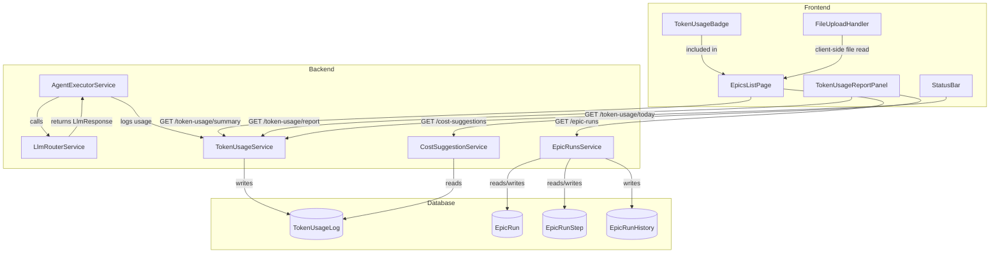

# Design Document: AIDLC Token Usage and Epic Enhancements

## Overview

This design introduces token usage tracking, cost optimization, workflow flexibility improvements, and a dedicated epics management page to the AI-DLC workspace. The system captures every LLM call's token consumption, calculates costs using configurable per-model pricing, surfaces usage data through UI badges and a report panel, provides AI-driven cost suggestions, enables reopening approved steps, supports file-based input for descriptions/feedback, and adds a filterable/sortable epics list page.

The architecture follows the existing NestJS modular pattern with Prisma ORM for data access and React 19 + Tailwind CSS for the frontend. New backend services are added to the `workspace` module, and new frontend components/pages extend the existing workspace feature.

## Architecture



### Key Design Decisions

1. **Token logging is fire-and-forget**: The `TokenUsageService.log()` call is non-blocking. If logging fails, the agent execution continues unaffected. Errors are logged but not propagated.

2. **Cost calculation at write time**: Estimated cost is computed when the log record is created, using the model pricing config at that moment. This avoids recalculating historical costs when pricing changes.

3. **File upload is client-side only**: The `FileUploadHandler` reads file content using the browser's `FileReader` API and populates a textarea. No file is uploaded to the server — only the extracted text content is submitted.

4. **Polling over WebSockets for report panel**: The report panel and epics list use polling (30s and 10s respectively) rather than WebSocket push. This keeps the implementation simple and aligns with the existing polling patterns in the codebase.

5. **Request Update preserves history**: When an approved step is reopened, the original approval timestamp is recorded in the history entry. The step's `approvedAt` field is cleared, but the history provides a full audit trail.

## Components and Interfaces

### Backend Components

#### TokenUsageService

Location: `packages/backend/src/workspace/token-usage/token-usage.service.ts`

```typescript
@Injectable()
export class TokenUsageService {
  constructor(private readonly prisma: PrismaService) {}

  /**
   * Log a single LLM call's token usage. Fire-and-forget.
   */
  async log(params: {
    projectId: string;
    epicRunId: string;
    epicRunStepId: string;
    agentProfileId: string;
    model: string;
    provider: string;
    inputTokens: number;
    outputTokens: number;
    promptHash?: string;
    metadata?: Record<string, unknown>;
  }): Promise<void>;

  /**
   * Get aggregated token usage for an epic run.
   */
  async getEpicRunUsage(epicRunId: string): Promise<{
    totalInputTokens: number;
    totalOutputTokens: number;
    totalCost: number;
  }>;

  /**
   * Get aggregated token usage for a specific step.
   */
  async getStepUsage(epicRunStepId: string): Promise<{
    totalInputTokens: number;
    totalOutputTokens: number;
    totalCost: number;
  }>;

  /**
   * Get today's usage summary for a project.
   */
  async getTodaySummary(projectId: string): Promise<{
    totalTokens: number;
    estimatedCost: number;
  }>;

  /**
   * Get the full report data for the report panel.
   */
  async getReport(projectId: string): Promise<{
    today: { totalTokens: number; estimatedCost: number };
    thisMonth: { totalTokens: number; estimatedCost: number };
    byModel: Array<{ model: string; tokens: number; percentage: number }>;
    byAgent: Array<{ agentName: string; tokens: number; percentage: number }>;
    dailyTrend: Array<{ date: string; cost: number }>;
  }>;

  /**
   * Query usage logs with filters for the cost suggestion engine.
   */
  async queryLogs(params: {
    projectId: string;
    fromDate: Date;
    toDate: Date;
  }): Promise<TokenUsageLog[]>;
}
```

#### CostSuggestionService

Location: `packages/backend/src/workspace/token-usage/cost-suggestion.service.ts`

```typescript
export interface CostSuggestion {
  type: 'high_usage_agent' | 'model_downgrade' | 'prompt_caching';
  message: string;
  affectedEntity: string; // agent name or skill name
  estimatedMonthlySavings: number;
}

@Injectable()
export class CostSuggestionService {
  constructor(private readonly tokenUsageService: TokenUsageService) {}

  /**
   * Analyze last 30 days and generate cost suggestions.
   * Returns empty list with message if fewer than 10 records exist.
   */
  async getSuggestions(projectId: string): Promise<{
    suggestions: CostSuggestion[];
    message?: string;
  }>;
}
```

#### EpicRunsService (Updated)

New method added to existing service:

```typescript
/**
 * Request update on an approved step.
 * Resets step to "running", resets downstream steps, updates history.
 */
async requestUpdate(
  id: string,
  stepId: string,
  dto: { reason?: string; context?: string }
): Promise<EpicRun>;
```

#### TokenUsageController

Location: `packages/backend/src/workspace/token-usage/token-usage.controller.ts`

```typescript
@Controller('projects/:projectId/workspace/token-usage')
export class TokenUsageController {
  @Get('today')        // → getTodaySummary
  @Get('report')       // → getReport
  @Get('epic-run/:epicRunId')  // → getEpicRunUsage
  @Get('step/:stepId')         // → getStepUsage
  @Get('suggestions')          // → CostSuggestionService.getSuggestions
}
```

### Frontend Components

#### EpicsListPage

Location: `packages/frontend/src/features/workspace/pages/EpicsListPage.tsx`

- Route: `/projects/:id/workspace/epics`
- Displays all epic runs in a table/card layout
- Columns: status badge, progress (X/Y steps), pipeline name, work item title, token usage badge, creation date, quick actions
- Filters: status dropdown (pending, running, paused, completed, failed, cancelled)
- Sorting: creation date (asc/desc), token usage (asc/desc)
- Empty state with CTA to create new epic run
- Polls every 10 seconds for updates

#### TokenUsageReportPanel

Location: `packages/frontend/src/features/workspace/components/TokenUsageReportPanel.tsx`

- Slide-over panel triggered from status bar
- Sections: Today summary, Month summary, By Model breakdown, By Agent breakdown, Daily trend chart
- Auto-refreshes every 30 seconds
- Uses a simple bar chart for daily trend (CSS-based or lightweight chart lib)

#### TokenUsageBadge

Location: `packages/frontend/src/features/workspace/components/TokenUsageBadge.tsx`

- Compact inline badge showing formatted token count
- Props: `tokens: number | null`, `size?: 'sm' | 'md'`
- Formats: "—" for null, "12.3k" for thousands, "1.2M" for millions

#### FileUploadHandler

Location: `packages/frontend/src/features/workspace/components/FileUploadHandler.tsx`

- Accepts `.md` and `.txt` files only
- Max size: 500 KB
- Supports click-to-browse and drag-and-drop
- On valid file: reads content via FileReader, calls `onContent(text: string)` callback
- On invalid file: displays inline error message
- Does NOT upload to server

#### StatusBarTokenIndicator

Location: `packages/frontend/src/features/workspace/components/StatusBarTokenIndicator.tsx`

- Shows today's estimated cost in the status bar area
- Clicking opens the TokenUsageReportPanel

### Model Pricing Configuration

Location: `packages/backend/src/workspace/token-usage/model-pricing.config.ts`

```typescript
export interface ModelPricing {
  model: string;
  provider: string;
  inputPricePerToken: number;  // USD per token
  outputPricePerToken: number; // USD per token
}

export const MODEL_PRICING: ModelPricing[] = [
  { model: 'claude-sonnet-4-5', provider: 'claude', inputPricePerToken: 0.000003, outputPricePerToken: 0.000015 },
  { model: 'claude-3-haiku', provider: 'claude', inputPricePerToken: 0.00000025, outputPricePerToken: 0.00000125 },
  { model: 'gpt-4o', provider: 'openai', inputPricePerToken: 0.0000025, outputPricePerToken: 0.00001 },
  { model: 'gpt-4o-mini', provider: 'openai', inputPricePerToken: 0.00000015, outputPricePerToken: 0.0000006 },
  // Fallback for unknown models
];

export function calculateCost(
  model: string,
  inputTokens: number,
  outputTokens: number,
): number;

export function getModelPricing(model: string): ModelPricing | undefined;
```

## Data Models

### New Prisma Model: TokenUsageLog

```prisma
model TokenUsageLog {
  id             String   @id @default(uuid())
  projectId      String   @map("project_id")
  epicRunId      String   @map("epic_run_id")
  epicRunStepId  String   @map("epic_run_step_id")
  agentProfileId String   @map("agent_profile_id")
  model          String
  provider       String
  inputTokens    Int      @map("input_tokens")
  outputTokens   Int      @map("output_tokens")
  estimatedCost  Float    @map("estimated_cost")  // USD
  promptHash     String?  @map("prompt_hash")     // SHA-256 of input for caching detection
  metadata       Json?
  createdAt      DateTime @default(now()) @map("created_at")

  project      Project      @relation(fields: [projectId], references: [id], onDelete: Cascade)
  epicRun      EpicRun      @relation(fields: [epicRunId], references: [id], onDelete: Cascade)
  epicRunStep  EpicRunStep  @relation(fields: [epicRunStepId], references: [id], onDelete: Cascade)
  agentProfile AgentProfile @relation(fields: [agentProfileId], references: [id])

  @@index([projectId, createdAt])
  @@index([epicRunId])
  @@index([epicRunStepId])
  @@index([agentProfileId])
  @@index([promptHash])
  @@map("token_usage_logs")
}
```

### Updated Models

**EpicRun** — Add relation:
```prisma
tokenUsageLogs TokenUsageLog[]
```

**EpicRunStep** — Add relation:
```prisma
tokenUsageLogs TokenUsageLog[]
```

**AgentProfile** — Add relation:
```prisma
tokenUsageLogs TokenUsageLog[]
```

**Project** — Add relation:
```prisma
tokenUsageLogs TokenUsageLog[]
```

### API Response Shapes

#### GET /projects/:projectId/workspace/token-usage/today
```json
{
  "totalTokens": 45230,
  "estimatedCost": 0.42
}
```

#### GET /projects/:projectId/workspace/token-usage/report
```json
{
  "today": { "totalTokens": 45230, "estimatedCost": 0.42 },
  "thisMonth": { "totalTokens": 1234567, "estimatedCost": 12.34 },
  "byModel": [
    { "model": "claude-sonnet-4-5", "tokens": 900000, "percentage": 72.9 },
    { "model": "gpt-4o", "tokens": 334567, "percentage": 27.1 }
  ],
  "byAgent": [
    { "agentName": "Code Generator", "tokens": 600000, "percentage": 48.6 },
    { "agentName": "Reviewer", "tokens": 400000, "percentage": 32.4 }
  ],
  "dailyTrend": [
    { "date": "2025-01-01", "cost": 0.35 },
    { "date": "2025-01-02", "cost": 0.52 }
  ]
}
```

#### GET /projects/:projectId/workspace/token-usage/suggestions
```json
{
  "suggestions": [
    {
      "type": "high_usage_agent",
      "message": "Agent 'Code Generator' uses 4.2x more tokens than the project average.",
      "affectedEntity": "Code Generator",
      "estimatedMonthlySavings": 8.50
    },
    {
      "type": "model_downgrade",
      "message": "Agent 'Linter' consistently uses fewer than 1,000 output tokens. Consider using gpt-4o-mini.",
      "affectedEntity": "Linter",
      "estimatedMonthlySavings": 3.20
    }
  ]
}
```


## Correctness Properties

*A property is a characteristic or behavior that should hold true across all valid executions of a system — essentially, a formal statement about what the system should do. Properties serve as the bridge between human-readable specifications and machine-verifiable correctness guarantees.*

### Property 1: Cost calculation formula

*For any* valid model pricing configuration and any non-negative integer pair (inputTokens, outputTokens), the `calculateCost` function SHALL return exactly `(inputTokens × inputPricePerToken) + (outputTokens × outputPricePerToken)`.

**Validates: Requirements 1.2**

### Property 2: Token usage log round-trip

*For any* valid LLM response with token usage data, when `TokenUsageService.log()` is called and the resulting record is queried back, the persisted record SHALL contain the exact same projectId, epicRunId, epicRunStepId, agentProfileId, model, provider, inputTokens, outputTokens, and estimatedCost that were provided as input.

**Validates: Requirements 1.1, 1.5**

### Property 3: Aggregation correctness

*For any* set of TokenUsageLog records belonging to the same epicRunId, the aggregated totalInputTokens SHALL equal the sum of individual inputTokens, the aggregated totalOutputTokens SHALL equal the sum of individual outputTokens, and the aggregated totalCost SHALL equal the sum of individual estimatedCost values.

**Validates: Requirements 1.4**

### Property 4: Token count formatting

*For any* non-negative integer N, the token formatter SHALL produce: the raw number string for N < 1000, a string ending in "k" for 1000 ≤ N < 1,000,000, and a string ending in "M" for N ≥ 1,000,000. For null/undefined input, it SHALL produce "—".

**Validates: Requirements 2.3, 2.4**

### Property 5: Percentage breakdown sums to 100%

*For any* non-empty array of token usage values grouped by category (model or agent), the computed percentage values SHALL sum to 100% (within ±0.1% floating-point tolerance), and each individual percentage SHALL equal `(categoryTokens / totalTokens) × 100`.

**Validates: Requirements 3.3, 3.4**

### Property 6: Request update resets step and downstream

*For any* epic run with N steps where step K has status "approved", calling `requestUpdate` on step K SHALL result in: step K having status "running" with a new startedAt timestamp, all steps with stepOrder > K having status "pending", and the epic run's currentStep being set to K.

**Validates: Requirements 4.1, 4.3, 4.4, 4.6**

### Property 7: Request update creates history with original approval

*For any* approved epic run step with an approvedAt timestamp, calling `requestUpdate` with a reason string SHALL create an EpicRunHistory record with action "update_requested" whose details contain the original approvedAt timestamp and the provided reason.

**Validates: Requirements 4.2**

### Property 8: File validation accepts only .md/.txt under 500KB

*For any* file with a given filename and size, the file validator SHALL accept the file if and only if the extension is ".md" or ".txt" AND the size is ≤ 512,000 bytes. All other combinations SHALL be rejected.

**Validates: Requirements 5.4, 5.5**

### Property 9: High-usage agent detection

*For any* set of TokenUsageLog records spanning 30 days where at least 10 records exist, if an agent's average total tokens per call exceeds 3× the project-wide average, the CostSuggestionService SHALL include a suggestion of type "high_usage_agent" naming that agent.

**Validates: Requirements 6.2**

### Property 10: Model downgrade suggestion for low-output agents

*For any* set of TokenUsageLog records where an agent's records ALL have outputTokens < 1000, the CostSuggestionService SHALL include a suggestion of type "model_downgrade" naming that agent.

**Validates: Requirements 6.3**

### Property 11: Prompt caching suggestion for repeated hashes

*For any* set of TokenUsageLog records where a specific promptHash appears more than 5 times within any 7-day window, the CostSuggestionService SHALL include a suggestion of type "prompt_caching" referencing that repeated prompt.

**Validates: Requirements 6.4**

### Property 12: All suggestions have required fields

*For any* non-empty suggestion list returned by the CostSuggestionService, every suggestion SHALL have a non-empty `type`, a non-empty `message`, a non-empty `affectedEntity`, and a non-negative `estimatedMonthlySavings`.

**Validates: Requirements 6.5**

### Property 13: Status filtering correctness

*For any* list of epic runs with mixed statuses and any single status filter value, the filtered result SHALL contain exactly those epic runs whose status matches the filter, with no omissions and no false inclusions.

**Validates: Requirements 7.4**

### Property 14: Sorting correctness

*For any* list of epic runs, sorting by creation date (ascending) SHALL produce a list where each element's createdAt is ≤ the next element's createdAt, and sorting by token usage (descending) SHALL produce a list where each element's total tokens is ≥ the next element's total tokens.

**Validates: Requirements 7.5**

## Error Handling

### Backend Error Handling

| Scenario | Behavior |
|----------|----------|
| Token logging fails (DB error) | Log error to console, do NOT propagate to agent execution. The LLM call result is still returned to the caller. |
| Model not found in pricing config | Use a fallback price of $0 (zero cost). Log a warning. |
| `requestUpdate` on non-approved step | Return 400 Bad Request with message indicating current status. |
| `requestUpdate` on non-existent step | Return 404 Not Found. |
| Cost suggestion query with < 10 records | Return 200 with empty suggestions array and `message: "Insufficient data. At least 10 token usage records are needed for analysis."` |
| Token usage query for non-existent project | Return 404 Not Found. |
| Aggregation query returns no records | Return zeroed summary: `{ totalTokens: 0, estimatedCost: 0 }`. |

### Frontend Error Handling

| Scenario | Behavior |
|----------|----------|
| File upload with invalid extension | Display inline error: "Only .md and .txt files are supported." |
| File upload exceeds 500 KB | Display inline error: "File size exceeds the 500 KB limit." |
| FileReader error | Display inline error: "Failed to read file. Please try again." |
| Token usage API returns error | Show "—" in badges, show error toast in report panel. |
| Polling request fails | Silently retry on next interval. Show stale data indicator after 3 consecutive failures. |
| Report panel data loading | Show skeleton/shimmer placeholders while loading. |

## Testing Strategy

### Property-Based Testing

**Library**: [fast-check](https://github.com/dubzzz/fast-check) (TypeScript PBT library, well-suited for NestJS + Jest)

**Configuration**: Minimum 100 iterations per property test.

**Tag format**: `Feature: aidlc-token-usage-enhancements, Property {number}: {property_text}`

Property tests cover:
- `calculateCost` pure function (Property 1)
- Token usage log creation and retrieval (Property 2)
- Aggregation sum correctness (Property 3)
- `formatTokenCount` pure function (Property 4)
- Percentage breakdown calculation (Property 5)
- `requestUpdate` state machine transitions (Property 6, 7)
- File validation logic (Property 8)
- Cost suggestion detection rules (Properties 9, 10, 11, 12)
- List filtering and sorting (Properties 13, 14)

### Unit Tests (Example-Based)

Unit tests focus on:
- Edge cases: missing usage data (1.3), null tokens for badge (2.4), insufficient data for suggestions (6.6), completed epic run status transition (4.5)
- UI component rendering: badge displays, report panel sections, empty states
- API controller request/response mapping
- File upload drag-and-drop interaction
- Polling timer behavior (3.5, 7.7)

### Integration Tests

Integration tests cover:
- Full API endpoint flows (create log → query aggregation → verify response)
- `requestUpdate` end-to-end with database verification
- Cost suggestion generation with realistic data distributions
- Token usage report endpoint with time-range queries

### Test Organization

```
packages/backend/src/workspace/token-usage/
├── token-usage.service.spec.ts          # Unit + property tests for service
├── token-usage.controller.spec.ts       # Controller unit tests
├── cost-suggestion.service.spec.ts      # Unit + property tests for suggestions
├── model-pricing.spec.ts               # Property tests for cost calculation
└── token-usage.integration.spec.ts     # Integration tests

packages/backend/src/workspace/epic-runs/
├── epic-runs.service.spec.ts           # Updated with requestUpdate property tests

packages/frontend/src/features/workspace/components/
├── TokenUsageBadge.test.tsx            # Property + unit tests for formatter
├── FileUploadHandler.test.tsx          # Property + unit tests for validation
├── TokenUsageReportPanel.test.tsx      # Unit tests
└── StatusBarTokenIndicator.test.tsx    # Unit tests

packages/frontend/src/features/workspace/pages/
├── EpicsListPage.test.tsx             # Property tests for filter/sort + unit tests
```
