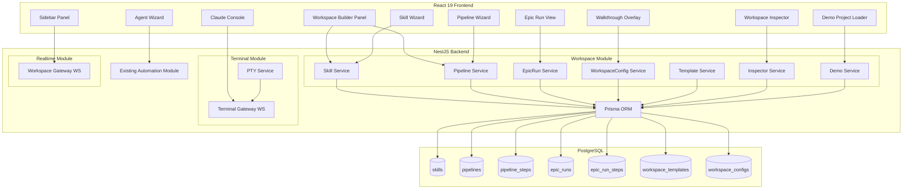

# Design Document: AIDLC Workspace Builder

## Overview

The AIDLC Workspace Builder extends the SDLC Hub with a visual workspace for composing, managing, and executing AI-driven development lifecycle pipelines. It introduces first-class **Skill**, **Pipeline**, **EpicRun**, **WorkspaceConfig**, and **WorkspaceTemplate** entities, along with a suite of frontend wizards and tools that allow users to build, template, inspect, and run AIDLC workflows without writing YAML manually.

The feature builds on the existing automation module (agents, orchestration, agent-runtime) and reuses the current NestJS modular monolith architecture, Prisma ORM, and React 19 frontend. New backend modules are added under a `workspace` service group within the automation domain, while new frontend pages and components extend the existing project-scoped navigation.

### Key Design Decisions

1. **Skill as a first-class entity**: Skills move from string arrays (`skillSet` on `AgentProfile`) to standalone markdown documents with structured metadata, stored in the database with content in a text column. This enables reuse, versioning, and template-based creation.

2. **Pipeline replaces phase-agent mapping for AIDLC**: While the existing `PhaseAgentMapping` + `WorkflowExecution` model remains for traditional orchestration, Pipelines provide a simpler, user-defined sequential chain of agents with per-step failure behavior. EpicRuns execute pipelines with human-in-the-loop approval gates.

3. **workspace.yaml as a projection**: The workspace.yaml file is generated from database state (agents, skills, pipelines, slash commands) rather than being the source of truth. The Inspector parses and validates it, but mutations flow through the API. This avoids file-sync conflicts while giving users a portable, readable configuration artifact.

4. **WebSocket for real-time updates**: The Sidebar Panel and EpicRun status use WebSocket (Socket.IO via NestJS gateway) for live updates rather than polling, reusing the pattern already available in NestJS.

5. **xterm.js for Claude Console**: The embedded terminal uses xterm.js on the frontend with a backend PTY service that spawns Claude CLI processes, communicating over WebSocket for real-time I/O streaming.

## Architecture



### Module Placement

| New Module | Location | Responsibility |
|---|---|---|
| WorkspaceModule | `packages/backend/src/workspace/` | Skills, Pipelines, EpicRuns, WorkspaceConfig, Templates, Inspector, Demo |
| TerminalModule | `packages/backend/src/terminal/` | PTY management, WebSocket terminal gateway |
| RealtimeModule | `packages/backend/src/realtime/` | WebSocket gateway for live workspace status updates |

The `WorkspaceModule` is registered in `AppModule` alongside the existing `AutomationModule`. It imports `PrismaModule` and `AuditModule` for data access and audit logging.

## Components and Interfaces

### Backend API Endpoints

#### Skills API (`/api/projects/:projectId/skills`)

| Method | Path | Description |
|---|---|---|
| GET | `/` | List all skills for a project |
| GET | `/:id` | Get skill by ID |
| POST | `/` | Create a new skill |
| PUT | `/:id` | Update skill content and metadata |
| DELETE | `/:id` | Delete a skill |
| POST | `/validate` | Validate skill markdown structure |
| GET | `/templates` | List available skill templates |

#### Pipelines API (`/api/projects/:projectId/pipelines`)

| Method | Path | Description |
|---|---|---|
| GET | `/` | List all pipelines for a project |
| GET | `/:id` | Get pipeline with steps |
| POST | `/` | Create a new pipeline |
| PUT | `/:id` | Update pipeline metadata |
| PUT | `/:id/steps` | Reorder/update pipeline steps |
| DELETE | `/:id` | Delete a pipeline |

#### Epic Runs API (`/api/projects/:projectId/epic-runs`)

| Method | Path | Description |
|---|---|---|
| GET | `/` | List epic runs (with status filter) |
| GET | `/:id` | Get epic run with step details |
| POST | `/` | Create a new epic run (bind pipeline to work item) |
| POST | `/:id/steps/:stepId/approve` | Approve a completed step |
| POST | `/:id/steps/:stepId/reject` | Reject a step with feedback |
| POST | `/:id/steps/:stepId/rerun` | Rerun a rejected step |
| GET | `/:id/history` | Get full execution history |

#### Workspace Config API (`/api/projects/:projectId/workspace`)

| Method | Path | Description |
|---|---|---|
| GET | `/config` | Get current workspace config |
| PUT | `/config` | Update workspace config |
| GET | `/yaml` | Generate workspace.yaml content |
| POST | `/inspect` | Parse, validate, and resolve workspace.yaml |
| GET | `/status` | Get workspace status (counts, active runs) |

#### Templates API (`/api/organizations/:orgId/workspace-templates`)

| Method | Path | Description |
|---|---|---|
| GET | `/` | List templates (built-in + custom) |
| GET | `/:id` | Get template details |
| POST | `/` | Save current workspace as template |
| POST | `/:id/apply` | Apply template to a project |
| DELETE | `/:id` | Delete a custom template |

#### Demo API (`/api/projects/:projectId/workspace/demo`)

| Method | Path | Description |
|---|---|---|
| POST | `/load` | Load demo project |
| GET | `/status` | Check if demo is already loaded |

#### Terminal API (WebSocket)

| Event | Direction | Description |
|---|---|---|
| `terminal:open` | Client → Server | Open a new terminal session |
| `terminal:input` | Client → Server | Send input to terminal |
| `terminal:output` | Server → Client | Stream terminal output |
| `terminal:resize` | Client → Server | Resize terminal dimensions |
| `terminal:close` | Client → Server | Close terminal session |
| `terminal:error` | Server → Client | Terminal error notification |

#### Realtime Gateway (WebSocket)

| Event | Direction | Description |
|---|---|---|
| `workspace:subscribe` | Client → Server | Subscribe to project workspace updates |
| `workspace:status` | Server → Client | Live workspace status update |
| `epicrun:progress` | Server → Client | Epic run step progress update |

### Frontend Components

#### Pages

| Component | Route | Description |
|---|---|---|
| `WorkspaceBuilder` | `/projects/:id/workspace` | Main workspace builder panel |
| `EpicRunDetail` | `/projects/:id/workspace/runs/:runId` | Epic run detail with approval UI |

#### Panels

| Component | Location | Description |
|---|---|---|
| `WorkspaceSidebar` | Left sidebar (persistent) | Live counts, active runs, slash commands |
| `ClaudeConsole` | Bottom panel (toggleable) | Embedded terminal with tabs |

#### Wizards (Modal dialogs)

| Component | Description |
|---|---|
| `AddSkillWizard` | 4-source skill creation dialog |
| `AddAgentWizard` | Agent creation with skill/model picker |
| `AddPipelineWizard` | Step-builder pipeline creation |
| `SaveTemplateDialog` | Save workspace as template |
| `ApplyTemplateDialog` | Apply template with conflict resolution |
| `LoadDemoDialog` | Demo project confirmation dialog |

#### Shared Components

| Component | Description |
|---|---|
| `WorkspaceCard` | Draggable card for agent/skill/pipeline |
| `SkillEditor` | Markdown editor with validation |
| `PipelineStepBuilder` | Drag-and-drop step ordering with on-failure toggle |
| `ApprovalGateUI` | Approve/reject/rerun controls for epic run steps |
| `WalkthroughOverlay` | 6-step guided tour overlay |
| `InspectorOutput` | Syntax-highlighted YAML output panel |

## Data Models

### New Prisma Models

```prisma
// ============================================
// WORKSPACE — Skills
// ============================================

model Skill {
  id          String   @id @default(uuid())
  projectId   String   @map("project_id")
  name        String
  description String?
  content     String   // Full markdown content
  inputs      Json?    // [{ name, type, description }]
  outputs     Json?    // [{ name, type, description }]
  metadata    Json?    // Additional structured metadata
  displayOrder Int     @default(0) @map("display_order")
  createdAt   DateTime @default(now()) @map("created_at")
  updatedAt   DateTime @updatedAt @map("updated_at")

  project     Project  @relation(fields: [projectId], references: [id], onDelete: Cascade)
  agentSkills AgentSkill[]

  @@unique([projectId, name])
  @@map("skills")
}

model AgentSkill {
  id             String @id @default(uuid())
  agentProfileId String @map("agent_profile_id")
  skillId        String @map("skill_id")

  agentProfile AgentProfile @relation(fields: [agentProfileId], references: [id], onDelete: Cascade)
  skill        Skill        @relation(fields: [skillId], references: [id], onDelete: Cascade)

  @@unique([agentProfileId, skillId])
  @@map("agent_skills")
}

// ============================================
// WORKSPACE — Pipelines
// ============================================

model Pipeline {
  id          String   @id @default(uuid())
  projectId   String   @map("project_id")
  name        String
  description String?
  displayOrder Int     @default(0) @map("display_order")
  createdAt   DateTime @default(now()) @map("created_at")
  updatedAt   DateTime @updatedAt @map("updated_at")

  project  Project        @relation(fields: [projectId], references: [id], onDelete: Cascade)
  steps    PipelineStep[]
  epicRuns EpicRun[]

  @@unique([projectId, name])
  @@map("pipelines")
}

model PipelineStep {
  id             String @id @default(uuid())
  pipelineId     String @map("pipeline_id")
  agentProfileId String @map("agent_profile_id")
  stepOrder      Int    @map("step_order")
  onFailure      String @default("stop") // "stop" | "continue"

  pipeline     Pipeline     @relation(fields: [pipelineId], references: [id], onDelete: Cascade)
  agentProfile AgentProfile @relation(fields: [agentProfileId], references: [id])

  @@unique([pipelineId, stepOrder])
  @@map("pipeline_steps")
}

// ============================================
// WORKSPACE — Epic Runs
// ============================================

enum EpicRunStatus {
  pending
  running
  paused
  completed
  failed
  cancelled
}

enum EpicRunStepStatus {
  pending
  running
  completed
  approved
  rejected
  failed
  skipped
}

model EpicRun {
  id          String        @id @default(uuid())
  projectId   String        @map("project_id")
  pipelineId  String        @map("pipeline_id")
  workItemId  String        @map("work_item_id")
  status      EpicRunStatus @default(pending)
  currentStep Int           @default(0) @map("current_step")
  startedAt   DateTime?     @map("started_at")
  completedAt DateTime?     @map("completed_at")
  initiatedBy String        @map("initiated_by")
  createdAt   DateTime      @default(now()) @map("created_at")
  updatedAt   DateTime      @updatedAt @map("updated_at")

  project  Project       @relation(fields: [projectId], references: [id], onDelete: Cascade)
  pipeline Pipeline      @relation(fields: [pipelineId], references: [id])
  workItem WorkItem      @relation(fields: [workItemId], references: [id])
  steps    EpicRunStep[]

  @@map("epic_runs")
  @@index([projectId, status])
}

model EpicRunStep {
  id             String            @id @default(uuid())
  epicRunId      String            @map("epic_run_id")
  pipelineStepId String            @map("pipeline_step_id")
  agentProfileId String            @map("agent_profile_id")
  stepOrder      Int               @map("step_order")
  status         EpicRunStepStatus @default(pending)
  output         String?           // Agent output/artifact reference
  feedback       String?           // Rejection feedback
  context        String?           // Additional context for rerun
  startedAt      DateTime?         @map("started_at")
  completedAt    DateTime?         @map("completed_at")
  approvedAt     DateTime?         @map("approved_at")
  rejectedAt     DateTime?         @map("rejected_at")
  createdAt      DateTime          @default(now()) @map("created_at")
  updatedAt      DateTime          @updatedAt @map("updated_at")

  epicRun      EpicRun      @relation(fields: [epicRunId], references: [id], onDelete: Cascade)
  agentProfile AgentProfile @relation(fields: [agentProfileId], references: [id])

  @@unique([epicRunId, stepOrder])
  @@map("epic_run_steps")
  @@index([epicRunId, status])
}

model EpicRunHistory {
  id        String   @id @default(uuid())
  epicRunId String   @map("epic_run_id")
  stepOrder Int      @map("step_order")
  action    String   // "started" | "completed" | "approved" | "rejected" | "rerun" | "failed" | "skipped"
  actor     String?  // User who performed the action
  details   Json?    // Additional context (feedback, error, etc.)
  createdAt DateTime @default(now()) @map("created_at")

  @@map("epic_run_history")
  @@index([epicRunId])
}

// ============================================
// WORKSPACE — Configuration & Templates
// ============================================

model WorkspaceConfig {
  id          String   @id @default(uuid())
  projectId   String   @unique @map("project_id")
  slashCommands Json?  @map("slash_commands") // [{ name, description, action }]
  metadata    Json?    // Additional workspace metadata
  yamlContent String?  @map("yaml_content") // Cached generated YAML
  createdAt   DateTime @default(now()) @map("created_at")
  updatedAt   DateTime @updatedAt @map("updated_at")

  project Project @relation(fields: [projectId], references: [id], onDelete: Cascade)

  @@map("workspace_configs")
}

model WorkspaceTemplate {
  id             String   @id @default(uuid())
  organizationId String   @map("organization_id")
  name           String
  description    String?
  isBuiltIn      Boolean  @default(false) @map("is_built_in")
  content        Json     // Full workspace snapshot: { agents, skills, pipelines, slashCommands }
  createdAt      DateTime @default(now()) @map("created_at")
  updatedAt      DateTime @updatedAt @map("updated_at")

  organization Organization @relation(fields: [organizationId], references: [id], onDelete: Cascade)

  @@unique([organizationId, name])
  @@map("workspace_templates")
}

// ============================================
// WORKSPACE — Walkthrough State
// ============================================

model WalkthroughState {
  id          String   @id @default(uuid())
  userId      String   @map("user_id")
  projectId   String   @map("project_id")
  currentStep Int      @default(0) @map("current_step")
  completed   Boolean  @default(false)
  dismissedAt DateTime? @map("dismissed_at")
  createdAt   DateTime @default(now()) @map("created_at")
  updatedAt   DateTime @updatedAt @map("updated_at")

  @@unique([userId, projectId])
  @@map("walkthrough_states")
}
```

### Relationship Additions to Existing Models

The following relations are added to existing models:

- `Project` gains: `skills Skill[]`, `pipelines Pipeline[]`, `epicRuns EpicRun[]`, `workspaceConfig WorkspaceConfig?`
- `Organization` gains: `workspaceTemplates WorkspaceTemplate[]`
- `AgentProfile` gains: `agentSkills AgentSkill[]`, `pipelineSteps PipelineStep[]`, `epicRunSteps EpicRunStep[]`
- `WorkItem` gains: `epicRuns EpicRun[]`

### Workspace YAML Schema

The generated `workspace.yaml` follows this structure:

```yaml
version: "1.0"
metadata:
  project: "project-name"
  generatedAt: "2026-05-15T10:00:00Z"

agents:
  - id: "ba-agent"
    name: "BA Agent"
    model: "sonnet-4.6"
    skills:
      - "requirements-analysis"
      - "user-story-writing"

skills:
  - name: "requirements-analysis"
    description: "Analyzes requirements and produces user stories"
    inputs:
      - name: "epic_description"
        type: "string"
    outputs:
      - name: "user_stories"
        type: "markdown"

pipelines:
  - name: "sdlc-pipeline"
    steps:
      - agent: "ba-agent"
        onFailure: "stop"
      - agent: "dev-agent"
        onFailure: "stop"
      - agent: "qa-agent"
        onFailure: "continue"
      - agent: "devops-agent"
        onFailure: "stop"

slashCommands:
  - name: "/run-pipeline"
    description: "Execute the SDLC pipeline on an epic"
    action: "epic-run:create"
  - name: "/inspect"
    description: "Run workspace inspector"
    action: "workspace:inspect"

environment:
  CLAUDE_API_KEY: "${CLAUDE_API_KEY}"
  PROJECT_ROOT: "${PROJECT_ROOT}"
```

### Skill Markdown Schema

Skills are stored as markdown with YAML frontmatter:

```markdown
---
name: code-reviewer
description: Reviews code for quality, security, and best practices
inputs:
  - name: code_diff
    type: string
    description: The code diff to review
  - name: language
    type: string
    description: Programming language
outputs:
  - name: review_comments
    type: markdown
    description: Structured review comments
---

## Prompt Template

You are a senior code reviewer. Review the following {{language}} code diff:

```diff
{{code_diff}}
```

Provide feedback on:
1. Code quality and readability
2. Potential bugs or edge cases
3. Security concerns
4. Performance implications

Format your response as structured review comments.
```


## Correctness Properties

*A property is a characteristic or behavior that should hold true across all valid executions of a system — essentially, a formal statement about what the system should do. Properties serve as the bridge between human-readable specifications and machine-verifiable correctness guarantees.*

### Property 1: Skill persistence round-trip

*For any* valid skill markdown document (with correct YAML frontmatter containing name, description, and prompt template), creating the skill via the API and then reading it back SHALL produce an identical document with all metadata fields preserved.

**Validates: Requirements 1.5, 5.7**

### Property 2: Skill validation rejects invalid input

*For any* skill markdown that is missing required fields (name, description, or prompt template), has malformed YAML frontmatter, or has a name that conflicts with an existing skill in the project, the validation endpoint SHALL reject the submission with a specific error message identifying the issue.

**Validates: Requirements 1.6, 5.4, 5.8**

### Property 3: Display order persistence

*For any* permutation of cards within a category (agents, skills, or pipelines), applying the reorder operation and then querying the list SHALL return the cards in the exact order specified by the permutation.

**Validates: Requirements 1.2**

### Property 4: Epic run approval advances execution

*For any* epic run with N steps where step K (1 ≤ K < N) has status "completed", approving step K SHALL transition the run's current step to K+1 and set step K's status to "approved".

**Validates: Requirements 2.2, 2.3**

### Property 5: Epic run rejection cascades downstream reset

*For any* epic run with N steps where step K (1 ≤ K ≤ N) is rejected with feedback, all steps from K+1 to N SHALL have their status reset to "pending", and step K SHALL have its status set to "rejected" with the feedback stored.

**Validates: Requirements 2.4**

### Property 6: Epic run rerun context composition

*For any* rejected epic run step with rejection feedback F and optional new context C, initiating a rerun SHALL produce an execution context that contains F, and if C is provided, also contains C.

**Validates: Requirements 2.5, 2.6**

### Property 7: Epic run on-failure behavior

*For any* pipeline step configured with on-failure="stop", a step failure SHALL set the epic run status to "failed". *For any* pipeline step configured with on-failure="continue", a step failure SHALL mark the step as "failed" and advance execution to the next step.

**Validates: Requirements 2.7**

### Property 8: Epic run history completeness

*For any* sequence of actions (start, complete, approve, reject, rerun) performed on an epic run, the execution history SHALL contain one entry per action with the correct action type, actor, and a timestamp that is monotonically non-decreasing.

**Validates: Requirements 2.8**

### Property 9: Workspace status counts match reality

*For any* project workspace state, the workspace status endpoint SHALL return agent count equal to the number of agents in the project, skill count equal to the number of skills, pipeline count equal to the number of pipelines, and active run counts matching the actual epic runs grouped by status. Additionally, all slash commands in the workspace config SHALL appear in the status response with their names and descriptions.

**Validates: Requirements 3.1, 3.2, 3.4**

### Property 10: Agent ID slug generation

*For any* non-empty display name string, the auto-generated agent ID SHALL be a valid kebab-case string (lowercase alphanumeric characters separated by hyphens, no leading/trailing hyphens, no consecutive hyphens) that is deterministically derived from the display name.

**Validates: Requirements 6.4**

### Property 11: Agent and pipeline validation

*For any* agent submission with zero skills selected or no model chosen, the API SHALL reject with a validation error. *For any* pipeline submission with fewer than two steps or a non-unique name, the API SHALL reject with a validation error.

**Validates: Requirements 6.5, 7.5**

### Property 12: Conflicting ID alternative suggestion

*For any* agent ID that conflicts with an existing agent in the project, the API SHALL return a suggested alternative ID that does not conflict with any existing agent in the project and is still a valid kebab-case string.

**Validates: Requirements 6.6**

### Property 13: YAML generation completeness

*For any* project workspace containing agents, skills, pipelines, and slash commands, the generated workspace.yaml SHALL contain declarations for every agent, every skill, every pipeline (with all steps in correct order), and every slash command. The entity counts in the YAML SHALL match the database entity counts.

**Validates: Requirements 6.7, 7.7, 10.6**

### Property 14: Pipeline step reordering

*For any* pipeline with N steps and any valid permutation of those steps, applying the reorder operation SHALL update the step_order values such that querying the pipeline steps returns them in the new order.

**Validates: Requirements 7.4**

### Property 15: Template save/apply round-trip

*For any* project workspace configuration (agents, skills, pipelines, slash commands), saving it as a template and then applying that template to an empty project SHALL produce a workspace with the same set of entities (matching by name, content, and configuration).

**Validates: Requirements 8.1, 8.3**

### Property 16: Template conflict resolution

*For any* template application where the target project has K conflicting entities (by name), applying with "skip" resolution SHALL leave the existing K entities unchanged, applying with "overwrite" SHALL replace all K entities with template versions, and applying with "rename" SHALL create K new entities with suffixed names that don't conflict.

**Validates: Requirements 8.4**

### Property 17: Template deletion isolation

*For any* project that has had a template applied to it, deleting that template from the organization SHALL not modify or remove any entities in the project workspace.

**Validates: Requirements 8.6**

### Property 18: Workspace YAML parsing and validation

*For any* valid workspace YAML document conforming to the schema, the inspector parse operation SHALL succeed and produce a structured result containing the correct number of agents, skills, pipelines, and slash commands matching the YAML content.

**Validates: Requirements 10.1**

### Property 19: Environment variable resolution

*For any* workspace YAML containing N environment variable references of the form `${VAR_NAME}`, and given an environment map with values for M of those variables (M ≤ N), the resolution operation SHALL substitute all M defined variables with their values and leave (N-M) references unresolved.

**Validates: Requirements 10.2**

### Property 20: Parse error reporting with line numbers

*For any* workspace YAML with a syntax error injected at line L, the inspector SHALL report a parse error referencing line L (±1 for parser tolerance).

**Validates: Requirements 10.4**

### Property 21: Unresolved environment variable warnings

*For any* workspace YAML containing references to K undefined environment variables, the inspector SHALL list exactly K warnings, each identifying the unresolved variable name.

**Validates: Requirements 10.5**

## Error Handling

### Backend Error Handling

| Error Scenario | HTTP Status | Response | Recovery |
|---|---|---|---|
| Skill markdown validation failure | 422 | `{ error: "VALIDATION_ERROR", details: [{ field, message }] }` | User fixes markdown and resubmits |
| Skill name conflict | 409 | `{ error: "CONFLICT", message, suggestion }` | User renames or overwrites |
| Pipeline < 2 steps | 422 | `{ error: "VALIDATION_ERROR", message }` | User adds more steps |
| Pipeline name conflict | 409 | `{ error: "CONFLICT", message }` | User renames |
| Agent ID conflict | 409 | `{ error: "CONFLICT", message, suggestedId }` | User accepts suggestion or provides new ID |
| Epic run step not in approvable state | 400 | `{ error: "INVALID_STATE", message }` | User waits for step completion |
| Workspace YAML parse error | 200 | `{ valid: false, errors: [{ line, message }] }` | User fixes YAML issues |
| Template name conflict | 409 | `{ error: "CONFLICT", message }` | User renames template |
| Terminal service unavailable | 503 | WebSocket error event | Client shows retry button |
| Demo project conflict | 409 | `{ error: "WORKSPACE_EXISTS", message }` | User confirms overwrite/merge |
| Agent execution failure during epic run | — | Step marked failed, on-failure behavior applied | User reruns or pipeline continues |
| WebSocket disconnection | — | Client auto-reconnects with exponential backoff | Automatic recovery |

### Frontend Error Handling

- **Optimistic updates with rollback**: Card reordering and toggle changes apply optimistically; on API failure, the UI reverts to the previous state and shows a toast notification.
- **Form validation**: All wizard forms validate client-side before submission. Server-side validation errors are mapped to specific form fields.
- **WebSocket reconnection**: The sidebar panel and epic run views auto-reconnect on WebSocket disconnection with exponential backoff (1s, 2s, 4s, max 30s).
- **Terminal session recovery**: If the terminal WebSocket disconnects, the console shows a "Reconnecting..." overlay. If reconnection fails after 3 attempts, it shows a "Session lost" message with a "New Session" button.

### Data Integrity

- **Epic run state machine**: State transitions are enforced server-side. Invalid transitions (e.g., approving a pending step) return 400 errors.
- **Cascade deletion**: Deleting a pipeline that has active epic runs is blocked (409 Conflict). Deleting a skill removes it from agent-skill associations but does not delete agents.
- **Template isolation**: Templates store a snapshot of the workspace at save time. Changes to the source workspace after saving do not affect the template.

## Testing Strategy

### Property-Based Testing

**Library**: [fast-check](https://github.com/dubzzz/fast-check) (TypeScript PBT library, well-suited for the NestJS/Vitest ecosystem)

**Configuration**:
- Minimum 100 iterations per property test
- Each property test tagged with: `Feature: aidlc-workspace-builder, Property {number}: {title}`
- Tests run against an in-memory database (SQLite via Prisma) or mocked Prisma service for speed

**Property tests cover**:
- Skill validation and persistence (Properties 1, 2)
- Display order and step reordering (Properties 3, 14)
- Epic run state machine (Properties 4, 5, 6, 7, 8)
- Workspace status accuracy (Property 9)
- Slug generation (Property 10)
- Entity validation (Property 11)
- ID conflict resolution (Property 12)
- YAML generation (Property 13)
- Template round-trip and conflict resolution (Properties 15, 16, 17)
- Workspace inspector parsing and resolution (Properties 18, 19, 20, 21)

### Unit Tests (Example-Based)

Unit tests cover specific examples and edge cases not suited for PBT:

- Demo project loading creates expected entities (4.1, 4.2, 4.3)
- Skill templates contain correct content (5.2, 5.3)
- Model picker lists correct models (6.3)
- Built-in templates exist (8.5)
- Walkthrough state management (11.1–11.7)
- File upload size limit enforcement (5.5)
- On-failure toggle default value (7.3)

### Integration Tests

Integration tests verify cross-component behavior:

- WebSocket real-time updates (3.3)
- Terminal session lifecycle (9.1–9.7)
- Slash command execution (3.5)
- Demo project end-to-end loading (4.1–4.6)
- Template application across projects (8.3, 8.7)

### Test Organization

```
packages/backend/src/workspace/
├── __tests__/
│   ├── properties/
│   │   ├── skill-validation.property.spec.ts
│   │   ├── epic-run-state-machine.property.spec.ts
│   │   ├── display-order.property.spec.ts
│   │   ├── slug-generation.property.spec.ts
│   │   ├── yaml-generation.property.spec.ts
│   │   ├── yaml-inspector.property.spec.ts
│   │   ├── template-roundtrip.property.spec.ts
│   │   └── workspace-status.property.spec.ts
│   ├── unit/
│   │   ├── skill.service.spec.ts
│   │   ├── pipeline.service.spec.ts
│   │   ├── epic-run.service.spec.ts
│   │   ├── workspace-config.service.spec.ts
│   │   ├── template.service.spec.ts
│   │   ├── inspector.service.spec.ts
│   │   └── demo.service.spec.ts
│   └── integration/
│       ├── terminal.integration.spec.ts
│       ├── realtime.integration.spec.ts
│       └── demo-project.integration.spec.ts
```
